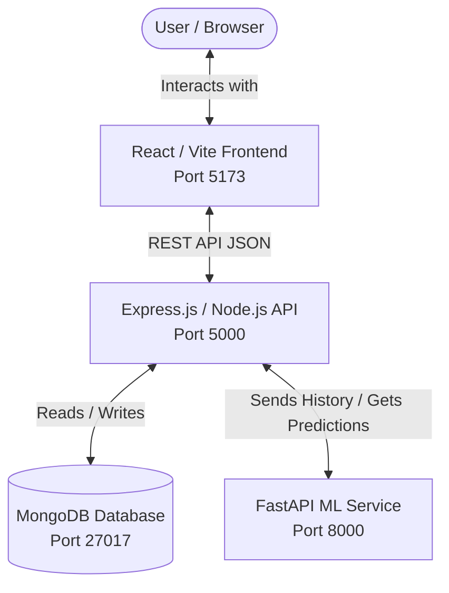

# AI-Powered Inventory & Demand Forecasting System

An intelligent, full-stack inventory management and demand forecasting platform. The system combines a modern React dashboard with a Node.js/Express API and a Python-based Machine Learning microservice to predict future product demand based on historical sales data, alert users to potential stockouts, and recommend inventory adjustments.

---

## 🏗️ System Architecture

The application is structured as a decoupled, multi-tier system:



1. **Frontend (React + Vite)**: A responsive single-page dashboard featuring real-time telemetry, charts (Zing/Recharts or custom Canvas-based demand charts), metric card components, stock alert listings, and search/filters.
2. **Backend (Node.js + Express)**: Serves REST endpoints for managing products, tracking sales history, and orchestrating forecasts. Connects directly to MongoDB.
3. **ML Service (FastAPI + Scikit-Learn)**: A lightweight Python microservice running a Ridge Regression time-series forecasting model. It processes historical sales datasets and returns demand predictions with 95% confidence bounds (upper and lower bounds).
4. **Database (MongoDB)**: Stores product inventories, raw sales history logs, and generated forecast outputs.

---

## 📋 Prerequisites

Before running the application, make sure you have the following installed:

- **Node.js** (v18 or higher)
- **npm** (v9 or higher)
- **Python** (v3.9 or higher)
- **MongoDB** (running locally on `mongodb://127.0.0.1:27017/inventory_forecasting`)

---

## ⚡ Quick Start Guide

To get the entire stack running, follow these steps in order:

### 1. Database Setup
Ensure your local MongoDB instance is running. By default, the backend expects a connection string of `mongodb://127.0.0.1:27017/inventory_forecasting`.

---

### 2. Backend Setup & Seeding
Open a terminal in the root directory:

```bash
# Navigate to the backend directory
cd backend

# Install Node dependencies
npm install

# Seed the database with 90 days of synthetic sales history
npm run seed

# Start the Backend server in Development Mode (runs on http://localhost:5000)
npm run dev
```

---

### 3. ML Service Setup
Open a new terminal in the root directory:

```bash
# Navigate to the ml-service directory
cd ml-service

# Create a virtual environment
python -m venv venv

# Activate the virtual environment
# On Windows:
venv\Scripts\activate
# On macOS/Linux:
source venv/bin/activate

# Install Python requirements
pip install -r requirements.txt

# Start the ML FastAPI Service (runs on http://localhost:8000)
python run.py
```

---

### 4. Frontend Setup
Open a new terminal in the root directory:

```bash
# Navigate to the frontend directory
cd frontend

# Install UI dependencies
npm install

# Start the Vite development server (runs on http://localhost:5173)
npm run dev
```

Visit **[http://localhost:5173](http://localhost:5173)** in your browser to view the application!

---

## 📂 Project Structure

```text
AI-Powered-Inventory-Demand-Forecasting-System/
├── backend/            # Express.js Server
│   ├── src/
│   │   ├── config/     # Database configurations
│   │   ├── controllers/# Route handlers (business logic)
│   │   ├── middleware/ # Custom middleware (error handling)
│   │   ├── models/     # Mongoose Schemas (Product, Sale, Forecast)
│   │   ├── routes/     # Express Route declarations
│   │   └── scripts/    # Database seeder scripts
│   └── package.json
│
├── frontend/           # React + Vite Client
│   ├── public/         # Static assets
│   ├── src/
│   │   ├── components/ # Reusable UI widgets (Charts, Sidebar, Cards)
│   │   ├── pages/      # Route pages (Overview, Inventory, Forecast)
│   │   ├── store/      # Zustand client-side state store
│   │   └── styles/     # Dashboard styling systems
│   └── package.json
│
└── ml-service/         # FastAPI Machine Learning Service
    ├── src/
    │   ├── app.py      # FastAPI routing & schema definitions
    │   └── model.py    # Ridge Regression model implementation
    ├── run.py          # Service startup runner
    └── requirements.txt
```

---

## 🔗 Component Documentation

For details about each individual component, check their respective sub-READMEs:
- 💻 **[Backend Service](file:///f:/GIT_Projects/AI-Powered-Inventory-Demand-Forecasting-System/backend/README.md)**: REST endpoints, database schemas, and data seeding details.
- 🎨 **[Frontend Webapp](file:///f:/GIT_Projects/AI-Powered-Inventory-Demand-Forecasting-System/frontend/README.md)**: User Interface, Zustand state actions, and view components.
- 🤖 **[ML Forecasting Service](file:///f:/GIT_Projects/AI-Powered-Inventory-Demand-Forecasting-System/ml-service/README.md)**: Forecasting algorithm details, feature engineering, and inference payload formats.
